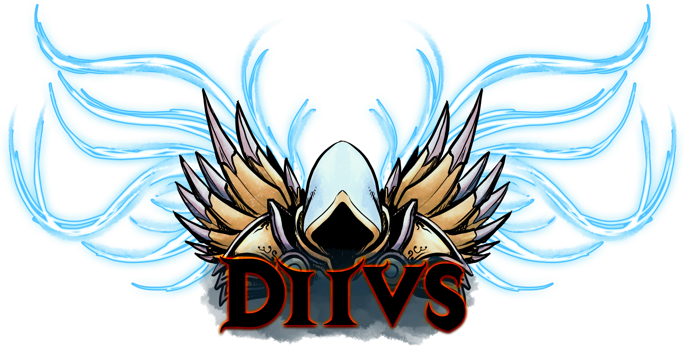

<div align="center">



</div>


## installation

```bash
$ pip install d2vs
```

_NOTE: this can run via CPU, but via GPU is far superior. You must install CUDA and the appropriate python jazz
to get that all going. This worked for me with CUDA10.1:_

```bash
$ conda install torch torchvision cudatoolkit=10.1 -c pytorch
```

# usage

<div align="center">

  

  _(586_gold.png)_
</div>


```py
import numpy as np
from d2vs.ocr import OCR
from PIL import Image

# Initiate OCR
ocr = OCR()

# Load an image
image_rgb_data = np.asarray(Image.open("586_gold.png"), dtype='uint8')

# Scan the image
bounds, text, item_type = ocr.read(image_rgb_data)

# What do we have to work with?
print(bounds)
# ([2, 2], [158, 2], [158, 32], [2, 32])
# which are top_left, top_right, bottom_right, bottom_left

print(text)
# '586 Gold'

print(item_type)
# 'Normal'
```

# project goals

 - ~~Have fun automating single player! Not for profit~~
 - ~~OCR with near 100% accuracy~~
 - ~~Visually determine where you are in game and use that for navigation~~
 - Path through unexplored areas to a goal
 - Pick it for identified items/gambling/etc.
 - Facilitate complete d2 bot from lvl 1 to 99

# development

## setup

```bash
$ git clone ...
$ pip install -r requirements.dev.txt
```

## running tests

```bash
$ pytest
```

## distributing

```bash
$ python setup.py sdist bdist_wheel
$ twine upload dist/*
```
